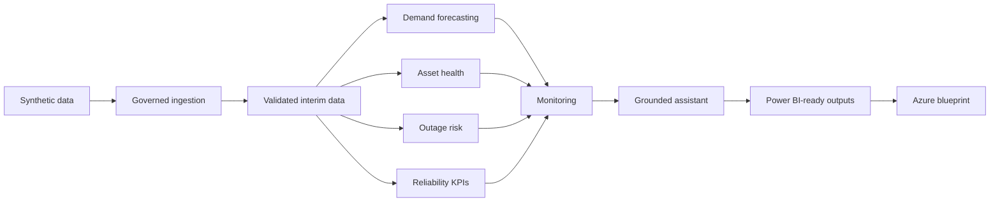

# Azure Grid Reliability Intelligence Platform

Grid Reliability Intelligence Platform is a local-first, Azure-mapped portfolio project for energy and critical infrastructure analytics. It demonstrates how synthetic grid telemetry can move through governed ingestion, validation, forecasting, asset-health analytics, outage-risk modelling, reliability KPI reporting, operational monitoring, retrieval-grounded assistance, Power BI-ready semantic outputs, and an Azure blueprint without using real grid data or deploying cloud resources.

The repository is complete through **Milestone 12: Portfolio Polish, Final QA, and Interview-Ready Documentation**.

## Business Problem

Electricity operators need reliable decision support across smart meter, substation, weather, asset, maintenance, and outage evidence. This project shows how those workflows can be engineered with reproducible local pipelines, governed evidence, transparent limitations, and a clear migration path to Azure services used in critical-infrastructure analytics.

## Architecture Summary

The local implementation runs entirely on Python, Make, checked-in configuration, deterministic synthetic data, local files, Markdown evidence, and automated tests. The target Azure architecture is documented as a blueprint using Bicep, diagrams, ADRs, and service mappings for Event Hubs, ADLS Gen2, Azure Data Explorer, Azure Machine Learning, Azure AI Foundry, Azure AI Search, Azure Monitor, Microsoft Purview, Power BI, and Microsoft Fabric.

No Azure resources are deployed. No Power BI workspace is deployed. No real grid, customer, address, coordinate, asset, outage, maintenance, or operational data is used.



See [docs/portfolio/architecture-walkthrough.md](docs/portfolio/architecture-walkthrough.md) and [diagrams/README.md](diagrams/README.md).

## Completed Milestones

1. Repository foundation and architecture scaffold.
2. Governed synthetic energy data generation.
3. Governed ingestion and data validation.
4. Electricity demand forecasting.
5. Asset health analytics.
6. Leakage-safe outage prediction.
7. Grid reliability KPI analytics.
8. Operational monitoring and data/model observability.
9. Local retrieval-grounded Grid Operations Assistant.
10. Power BI-ready dashboard outputs and executive reporting.
11. Azure reference architecture and deployment blueprint.
12. Portfolio polish, final QA, and interview-ready documentation.

Detailed milestone evidence is in [docs/milestones/roadmap.md](docs/milestones/roadmap.md).

## Repository Structure

```text
.
├── .github/workflows/          # CI and IaC blueprint validation
├── configs/                    # Local and CI pipeline configuration
├── dashboard/                  # Power BI-ready page specs, DAX, wireframes
├── data/                       # Ignored generated data with .gitkeep placeholders
├── diagrams/                   # Mermaid architecture and workflow diagrams
├── docs/                       # Architecture, domain, Azure, security, portfolio docs
├── infra/bicep/                # Blueprint-only Azure Bicep templates
├── outputs/                    # Ignored generated analytical outputs
├── reports/                    # Ignored generated Markdown/JSON reports
├── scripts/                    # Azure blueprint and repository QA scripts
├── src/grid_reliability/       # Local-first platform implementation
└── tests/                      # Unit tests, fixtures, and repository QA tests
```

## Quickstart

```bash
python -m venv .venv
source .venv/bin/activate
make install
make quality
```

The project uses synthetic data and local files only. Configuration starts in [configs/base.yaml](configs/base.yaml). Copy [.env.example](.env.example) only for local non-secret overrides.

## Full Local Demo

```bash
make generate-data-ci
make ingest-data-ci
make forecast-data-ci
make assess-asset-health-ci
make predict-outages-ci
make calculate-reliability-ci
make monitor-platform-ci
make run-assistant-ci
make build-reporting-model-ci
make verify-azure-blueprint
```

Expected generated paths include:

- `data/raw/` for synthetic source extracts.
- `data/interim/` for validated interim data.
- `outputs/forecasting/`, `outputs/asset_health/`, `outputs/outage_prediction/`, `outputs/reliability/`, `outputs/monitoring/`, `outputs/genai/`, and `outputs/reporting/`.
- `reports/ingestion/`, `reports/forecasting/`, `reports/asset_health/`, `reports/outage_prediction/`, `reports/reliability/`, `reports/monitoring/`, `reports/genai/`, and `reports/reporting/`.

Clean generated artifacts before review:

```bash
make clean-data clean-interim clean-quarantine clean-ingestion-reports
make clean-forecasting clean-model-artifacts clean-forecast-reports
make clean-asset-health clean-asset-health-reports
make clean-outage-prediction clean-outage-models clean-outage-reports
make clean-reliability clean-reliability-reports
make clean-monitoring clean-monitoring-reports
make clean-assistant clean-assistant-reports
make clean-reporting clean-reporting-reports clean
```

## Quality Gates

```bash
python3 -m ruff check .
python3 -m ruff format --check .
python3 -m mypy src
python3 -m pytest
python3 -m pytest --cov --cov-report=term-missing
make verify-azure-blueprint
make validate-iac
make portfolio-check
```

`make validate-iac` runs Azure CLI Bicep validation only when Azure CLI is already installed. CI does not log in to Azure and does not deploy anything.

## Security And Governance

- All datasets are synthetic and fictional.
- Local pipelines operate on validated interim data and governed evidence.
- The assistant is deterministic, retrieval-grounded, citation-producing, and limited to decision support.
- Security documentation includes a STRIDE threat model, Azure control matrix, ADRs, identity guidance, network guidance, and data governance notes.
- Runtime artifacts, caches, model files, reports, assistant indexes, coverage outputs, local environment files, and deployment artifacts are ignored by Git.

## Limitations

- Azure architecture is a blueprint only and is not deployed.
- Power BI-ready outputs are CSV, DAX text, catalogue, relationship, wireframe, and page-specification artifacts only.
- No `.pbix`, Power BI workspace, Fabric workspace, gateway, scheduled refresh, app, or REST API call is created.
- Models are deterministic local demonstrations over synthetic data; they are not calibrated for live grid operations.
- Monitoring alerts are local review artifacts only and do not notify external systems.
- The assistant cannot execute operations, suppress alerts, dispatch crews, call Azure OpenAI, call Azure AI Foundry, or call external APIs.

## Interview Talking Points

- Explain the system as an end-to-end governed evidence pipeline, not as a cloud deployment.
- Walk from synthetic source data to validated interim data, analytics, monitoring, assistant evidence, and Power BI-ready outputs.
- Emphasise leakage controls, deterministic tests, human review, decision support, and critical-infrastructure safety boundaries.
- Describe the Azure blueprint as a target architecture with IaC and operational guidance, not proof of deployed services.
- Use [docs/portfolio/interview-talking-points.md](docs/portfolio/interview-talking-points.md) for concise interview responses.

## What This Demonstrates

This repository demonstrates Azure solution architecture, Python data engineering, local MLOps patterns, time-series forecasting, classification, asset analytics, reliability engineering, governance, security, observability, GenAI/RAG safety boundaries, Power BI semantic modelling, CI/CD, Infrastructure as Code, and critical infrastructure domain understanding.

Start with [docs/portfolio/reviewer-guide.md](docs/portfolio/reviewer-guide.md) for a fast review path.

## Licence

This project is licensed under the MIT License.
