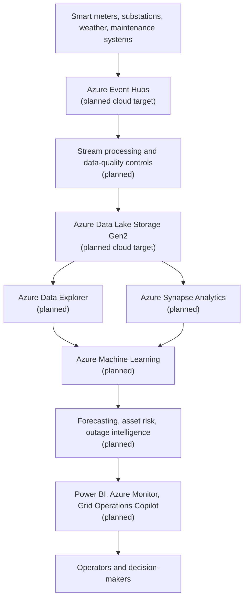

# Azure Grid Reliability Intelligence Platform

A local-first, Azure-mapped foundation for grid reliability and energy operations intelligence across synthetic telemetry, data quality, forecasting, asset health, outage risk, operational monitoring, and analytical reporting.

This repository is currently at **Milestone 1: Repository Foundation and Architecture Scaffold**. It establishes the engineering structure and shared foundations only. It does not yet generate datasets, run ingestion, train models, calculate reliability KPIs, build dashboards, integrate GenAI, or deploy Azure resources.

## Problem Statement

Electricity networks need reliable ways to combine smart meter, substation, weather, asset, maintenance, and outage data into operational intelligence. The platform is designed to show how those workflows can be developed locally with clear mappings to Azure services used in critical-infrastructure analytics.

## Target Capabilities

- Synthetic smart meter and substation telemetry.
- Batch and event-driven ingestion.
- Data validation and quality controls.
- Short-term demand and load forecasting.
- Asset health and failure-risk assessment.
- Anomaly detection and outage prediction.
- Reliability KPI calculation and executive reporting.
- Operational monitoring.
- GenAI-assisted incident and maintenance analysis.
- Power BI-ready analytical outputs.
- Azure reference architecture and deployment guidance.

## Architecture



Local simulations are intended to demonstrate architecture, testing, reproducibility, and engineering patterns. They are not evidence of live Azure deployment.

## Local-First and Azure Deployment

Milestone 1 runs locally and requires no Azure credentials. Future milestones will implement local equivalents of cloud capabilities first, then document how each maps to Azure services. Any live Azure deployment would require a subscription, identity configuration, RBAC, networking, service provisioning, and operational monitoring outside the current milestone.

## Azure Service Mapping

| Platform capability | Local-first implementation | Azure target |
| --- | --- | --- |
| Meter ingestion | JSONL/event simulator and Python consumers | Azure Event Hubs |
| Raw storage | Local filesystem partitioning | Azure Data Lake Storage Gen2 |
| Stream processing | Python event-processing pipeline | Azure Stream Analytics or Azure Functions |
| Analytical warehouse | Local analytical tables | Azure Synapse Analytics |
| Time-series analytics | Local Python/columnar analysis | Azure Data Explorer |
| ML lifecycle | Local reproducible training pipelines | Azure Machine Learning |
| GenAI operations assistant | Provider-neutral local interface | Azure AI Foundry |
| Monitoring | Structured logs and local metrics | Azure Monitor/Application Insights |
| Reporting | CSV/Parquet analytical outputs | Microsoft Power BI |
| Governance | Local metadata and documentation | Microsoft Purview |

## Planned Datasets

- `smart_meter_events.jsonl`
- `substation_events.jsonl`
- `weather_data.csv`
- `asset_inventory.csv`
- `maintenance_logs.csv`
- `outage_history.csv`

These datasets are planned for later milestones and are not committed in Milestone 1.

## Planned Analytical and ML Use Cases

- Short-term electricity-demand forecasting.
- Feeder and substation load forecasting.
- Asset health and failure-risk assessment.
- Outage prediction.
- Anomaly detection.
- Reliability scoring.
- Maintenance prioritisation.
- Incident investigation.
- Executive reliability reporting.

Planned reliability measures include SAIDI, SAIFI, CAIDI, availability, outage frequency, outage duration, restoration performance, load forecast error, and asset risk distribution. These measures are not implemented yet.

## Repository Structure

```text
.
├── .github/workflows/
├── configs/
├── dashboard/
├── data/
│   ├── raw/
│   ├── interim/
│   └── processed/
├── diagrams/
├── docs/
│   ├── architecture/
│   ├── governance/
│   ├── operations/
│   └── milestones/
├── outputs/
├── reports/
├── scripts/
├── src/grid_reliability/
│   ├── common/
│   ├── data_generation/
│   ├── ingestion/
│   ├── validation/
│   ├── forecasting/
│   ├── asset_health/
│   ├── outage_prediction/
│   ├── reliability/
│   ├── anomaly_detection/
│   ├── genai/
│   ├── reporting/
│   └── monitoring/
└── tests/
    ├── unit/
    ├── integration/
    └── contract/
```

## Milestone Roadmap

1. Repository foundation and architecture scaffold.
2. Synthetic operational datasets.
3. Ingestion and data quality.
4. Forecasting and reliability analytics.
5. Asset health, outage risk, and anomaly detection.
6. Operations reporting and GenAI assistance.
7. Azure deployment guidance.

## Local Setup

```bash
python -m venv .venv
source .venv/bin/activate
make install
make quality
```

Configuration starts in `configs/base.yaml`. Copy `.env.example` to `.env` for local non-secret overrides. Do not commit real secrets.

## Quality and Governance

The foundation uses Ruff, mypy, pytest, coverage, typed settings, deterministic tests, a documented data-classification approach, and a CI workflow that does not require Azure authentication.

## Limitations and Current Status

Only Milestone 1 is implemented. The repository contains architecture scaffolding and shared foundation utilities, not production pipelines or live cloud infrastructure. Generated datasets, trained models, reports, dashboards, and Azure deployment artefacts are intentionally excluded from version control.

## Licence

This project is licensed under the MIT License.

