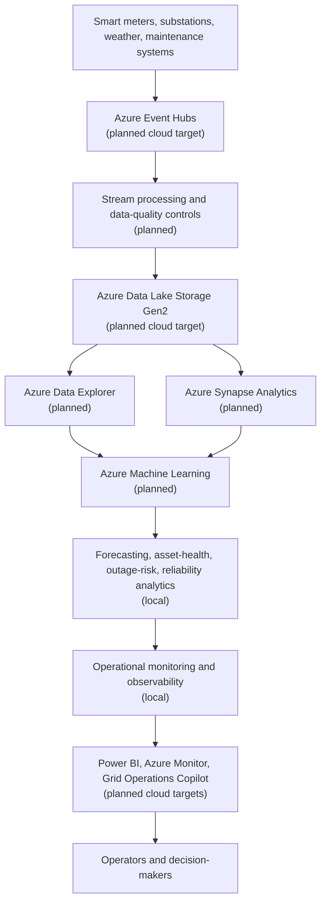

# Azure Grid Reliability Intelligence Platform

A local-first, Azure-mapped foundation for grid reliability and energy operations intelligence across synthetic telemetry, data quality, forecasting, asset health, outage risk, operational monitoring, and analytical reporting.

This repository is currently at **Milestone 8: Operational Monitoring and Data/Model Observability**. It establishes the engineering structure, shared foundations, deterministic fictional source data generation, governed local ingestion, reproducible local short-term forecasting, transparent asset-health scoring, leakage-safe synthetic outage-risk prediction, historical reliability KPI analytics, and local monitoring over runtime manifests and metrics. It does not build dashboards, integrate GenAI, deliver live alerts, or deploy Azure resources.

## Problem Statement

Electricity networks need reliable ways to combine smart meter, substation, weather, asset, maintenance, and outage data into operational intelligence. The platform is designed to show how those workflows can be developed locally with clear mappings to Azure services used in critical-infrastructure analytics.

## Target Capabilities

- Synthetic smart meter and substation telemetry.
- Batch and event-driven ingestion.
- Data validation and quality controls.
- Short-term demand and load forecasting.
- Asset health condition scoring.
- Outage prediction.
- Anomaly detection.
- Reliability KPI calculation and executive reporting.
- Operational monitoring.
- GenAI-assisted incident and maintenance analysis.
- Power BI-ready analytical outputs.
- Azure reference architecture and deployment guidance.

## Architecture



Local simulations are intended to demonstrate architecture, testing, reproducibility, and engineering patterns. They are not evidence of live Azure deployment.

## Local-First and Azure Deployment

Milestones 1 through 8 run locally and require no Azure credentials. Future milestones will document deployment guidance for Azure services. Any live Azure deployment would require a subscription, identity configuration, RBAC, networking, service provisioning, and operational monitoring outside the current milestone.

## Azure Service Mapping

| Platform capability | Local-first implementation | Azure target |
| --- | --- | --- |
| Meter ingestion | JSONL/event reader and Python batch pipeline | Azure Event Hubs |
| Raw storage | Local filesystem partitioning | Azure Data Lake Storage Gen2 |
| Stream processing | Finite local micro-batch abstraction | Azure Stream Analytics or Azure Functions |
| Analytical warehouse | Local analytical tables | Azure Synapse Analytics |
| Time-series analytics | Local Python/columnar analysis | Azure Data Explorer |
| ML lifecycle | Local forecasting, asset-health, outage-risk, and reliability batch pipelines | Azure Machine Learning |
| GenAI operations assistant | Provider-neutral local interface | Azure AI Foundry |
| Monitoring | Local observability CSV/JSON records, alert evaluations, metrics, manifests, and reports | Azure Monitor, Application Insights, Log Analytics, Azure Machine Learning monitoring, Microsoft Purview, and Power BI |
| Reporting | CSV/Parquet analytical outputs | Microsoft Power BI |
| Governance | Local metadata and documentation | Microsoft Purview |

## Planned Datasets

- `smart_meter_events.jsonl`
- `substation_events.jsonl`
- `weather_data.csv`
- `asset_inventory.csv`
- `maintenance_logs.csv`
- `outage_history.csv`

Full generated runtime datasets are written to `data/raw/` and ignored by Git. Small deterministic fixtures live under `tests/fixtures/synthetic_data/` for tests and documentation.

## Synthetic Data Generation

Generate the standard local dataset profile:

```bash
python3 -m grid_reliability.data_generation.pipeline --config configs/synthetic_data.yaml
```

Generate the smaller CI/test profile:

```bash
python3 -m grid_reliability.data_generation.pipeline --config configs/synthetic_data_ci.yaml
```

The generator supports implemented overrides for `--output-root`, `--seed`, `--start`, `--end`, and `--profile`. With the same seed and configuration, dataset contents are reproducible. The `_manifest.json` file includes a generation timestamp, so the manifest itself is not byte-for-byte deterministic across runs.

Example configuration:

```yaml
random_seed: 20260201
start_timestamp: "2026-01-01T00:00:00"
end_timestamp: "2026-01-01T06:00:00"
meter_interval_minutes: 60
number_of_regions: 2
substations_per_region: 1
feeders_per_substation: 1
meters_per_feeder: 3
output_root: data/raw
schema_version: "2.0.0"
```

All identifiers, locations, manufacturers, maintenance notes, and incidents are fictional. The data contains no real customers, addresses, postcodes, coordinates, utility assets, or operational systems.

## Governed Ingestion and Validation

Run local ingestion against generated sources:

```bash
python3 -m grid_reliability.ingestion.pipeline --config configs/ingestion.yaml
```

Run the small CI profile end to end:

```bash
python3 -m grid_reliability.data_generation.pipeline --config configs/synthetic_data_ci.yaml
python3 -m grid_reliability.ingestion.pipeline --config configs/ingestion_ci.yaml
```

The ingestion layer verifies `_manifest.json`, checks file sizes, SHA-256 checksums and record counts, parses CSV and JSON Lines, validates contracts and relationships, writes valid JSONL outputs to `data/interim/`, writes invalid records to `data/quarantine/<run_id>/`, and writes reports to `reports/ingestion/<run_id>/`.

Run statuses are `PASSED`, `PASSED_WITH_WARNINGS`, `FAILED_QUALITY_THRESHOLD`, `FAILED_MANIFEST`, `FAILED_CONFIGURATION`, and `FAILED_PROCESSING`. Failed statuses return a non-zero CLI exit code.

## Electricity Demand Forecasting

Run local forecasting against validated interim data:

```bash
python3 -m grid_reliability.forecasting.pipeline --config configs/forecasting.yaml
```

Run the small profile end to end:

```bash
python3 -m grid_reliability.data_generation.pipeline --config configs/synthetic_data_ci.yaml
python3 -m grid_reliability.ingestion.pipeline --config configs/ingestion_ci.yaml
python3 -m grid_reliability.forecasting.pipeline --config configs/forecasting_ci.yaml
```

Forecasting supports `active_energy_kwh` from smart meter events and `load_mw` from substation events at grid-region, substation, or feeder grain. The CI profile uses one-interval-ahead grid-region forecasts because it contains only six hourly timestamps.

Outputs are written under `outputs/forecasting/<run_id>/`, model metadata under `outputs/models/forecasting/<run_id>/`, and reports under `reports/forecasting/<run_id>/`. Generated CSV outputs are Power BI-ready, but no Power BI dashboard is created.

## Asset Health Analytics

Run local asset-health scoring against validated interim data:

```bash
python3 -m grid_reliability.asset_health.pipeline --config configs/asset_health.yaml
```

Run the small profile end to end:

```bash
python3 -m grid_reliability.data_generation.pipeline --config configs/synthetic_data_ci.yaml
python3 -m grid_reliability.ingestion.pipeline --config configs/ingestion_ci.yaml
python3 -m grid_reliability.asset_health.pipeline --config configs/asset_health_ci.yaml
```

Asset health supports `primary_substation`, `secondary_substation`, `transformer`, `circuit_breaker`, `feeder`, `switchgear`, and `protection_relay`. Smart meters are excluded by default. The score convention is `0` poorest condition and `100` strongest condition.

Outputs are written under `outputs/asset_health/<run_id>/` and reports under `reports/asset_health/<run_id>/`. The implementation separates condition score, criticality tier, operational evidence, and maintenance review priority. It is not a failure prediction or outage prediction model.

## Outage Prediction

Run local outage-risk prediction against validated interim data:

```bash
python3 -m grid_reliability.outage_prediction.pipeline --config configs/outage_prediction.yaml
```

Run the small profile end to end:

```bash
python3 -m grid_reliability.data_generation.pipeline --config configs/synthetic_data_ci.yaml
python3 -m grid_reliability.ingestion.pipeline --config configs/ingestion_ci.yaml
python3 -m grid_reliability.outage_prediction.pipeline --config configs/outage_prediction_ci.yaml
```

The CI profile predicts feeder-level unplanned outage risk within the next configured interval. Labels are leakage-safe: an outage is positive only when it starts after the observation timestamp and on or before the prediction horizon boundary. Planned outages are excluded.

Outputs are written under `outputs/outage_prediction/<run_id>/`, model metadata under `outputs/models/outage_prediction/<run_id>/`, and reports under `reports/outage_prediction/<run_id>/`. CSV outputs are Power BI-ready, but no Power BI dashboard is created.

## Reliability KPI Analytics

Run local reliability analytics against validated interim data:

```bash
python3 -m grid_reliability.reliability.pipeline --config configs/reliability.yaml
```

Run the small profile end to end:

```bash
python3 -m grid_reliability.data_generation.pipeline --config configs/synthetic_data_ci.yaml
python3 -m grid_reliability.ingestion.pipeline --config configs/ingestion_ci.yaml
python3 -m grid_reliability.reliability.pipeline --config configs/reliability_ci.yaml
```

Reliability analytics calculate SAIFI, SAIDI, CAIDI, ASAI, ASUI, event-level outage measures, internal trends, internal peer benchmarks, composite reliability scores, bands, and reason codes for grid regions, substations, and feeders. Population denominators use observed unique smart-meter IDs from validated interim events and are documented as observed-meter counts, not certified customer counts.

Outputs are written under `outputs/reliability/<run_id>/` and reports under `reports/reliability/<run_id>/`. Outputs are Power BI-ready CSV and JSON artifacts, but no Power BI project file or dashboard is created.

## Operational Monitoring

Run local monitoring against existing runtime artifacts:

```bash
python3 -m grid_reliability.monitoring.pipeline --config configs/monitoring.yaml
```

Run the small profile end to end:

```bash
make monitoring-demo
```

Monitoring discovers local component manifests and metrics for data generation, ingestion, forecasting, asset health, outage prediction, and reliability. It writes pipeline-health records, freshness and volume checks, quality-trend checks, schema and distribution drift records, model-health checks, analytical-health checks, deterministic alert evaluations, a monitoring manifest, metrics JSON, and Markdown reports.

Outputs are written under `outputs/monitoring/` and reports under `reports/monitoring/<run_id>/`. Alert records are local review artifacts only; no email, SMS, Teams, webhook, PagerDuty, Azure Monitor action group, Power BI dashboard, or Azure resource is created.

## Planned Analytical and ML Use Cases

- Short-term electricity-demand forecasting.
- Feeder and substation load forecasting.
- Asset health condition scoring and maintenance prioritisation.
- Outage prediction.
- Anomaly detection.
- Reliability scoring.
- Operational monitoring and observability.
- Maintenance prioritisation.
- Incident investigation.
- Executive reliability reporting.

Implemented reliability measures include SAIDI, SAIFI, CAIDI, ASAI, ASUI, outage frequency, outage duration, restoration performance, and composite reliability scoring. CTAIDI and CAIFI remain unsupported because distinct interrupted customer IDs are not present in the synthetic outage records.

## Repository Structure

```text
.
├── .github/workflows/
├── configs/
├── dashboard/
├── data/
│   ├── raw/
│   ├── interim/
│   └── processed/
├── diagrams/
├── docs/
│   ├── architecture/
│   ├── governance/
│   ├── operations/
│   └── milestones/
├── outputs/
├── reports/
├── scripts/
├── src/grid_reliability/
│   ├── common/
│   ├── data_generation/
│   ├── ingestion/
│   ├── validation/
│   ├── forecasting/
│   ├── asset_health/
│   ├── outage_prediction/
│   ├── reliability/
│   ├── anomaly_detection/
│   ├── genai/
│   ├── reporting/
│   └── monitoring/
└── tests/
    ├── unit/
    ├── integration/
    └── contract/
```

## Milestone Roadmap

1. Repository foundation and architecture scaffold.
2. Governed synthetic energy data generation.
3. Governed ingestion and data validation.
4. Electricity demand forecasting.
5. Asset health analytics.
6. Outage prediction.
7. Grid reliability scoring and KPI analytics.
8. Operational monitoring and observability.
9. Azure deployment guidance.

## Local Setup

```bash
python -m venv .venv
source .venv/bin/activate
make install
make quality
```

Configuration starts in `configs/base.yaml`. Copy `.env.example` to `.env` for local non-secret overrides. Do not commit real secrets.

## Quality and Governance

The foundation uses Ruff, mypy, pytest, coverage, typed settings, deterministic tests, a documented data-classification approach, and a CI workflow that does not require Azure authentication.

## Limitations and Current Status

Only Milestones 1 through 8 are implemented. The repository contains architecture scaffolding, shared foundation utilities, synthetic source data generation, governed local ingestion, local demand forecasting, local transparent asset-health analytics, local synthetic outage-risk prediction, local reliability KPI analytics, and local operational observability with manifests, metrics, CSV/JSON outputs, alert records, and reports. Asset-failure prediction, anomaly-detection models, dashboards, GenAI workflows, live alert delivery, and live Azure infrastructure remain future work. Generated runtime datasets, model artifacts, reports, monitoring outputs, dashboards, and Azure deployment artefacts are intentionally excluded from version control.

## Licence

This project is licensed under the MIT License.
