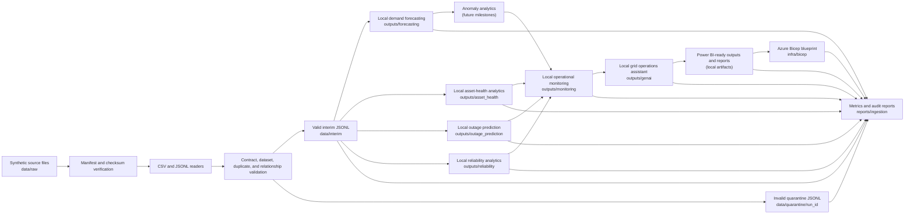

# Data Flow

Milestones 3 through 11 implement local governed movement from raw synthetic source files into interim and quarantine zones, then forecasting, asset-health analytics, outage prediction, reliability KPI analytics, operational monitoring, retrieval-grounded assistant responses, Power BI-ready reporting outputs, and a deployment-free Azure reference blueprint over governed runtime evidence.

The matching Azure pattern is Event Hubs, Azure Functions or Stream Analytics, Data Lake Storage Gen2 raw/quarantine/silver zones, Azure Monitor or Application Insights, Microsoft Purview, Azure Data Explorer or Synapse, Azure Machine Learning, and Power BI. These are mappings only; no Azure resources are deployed.
