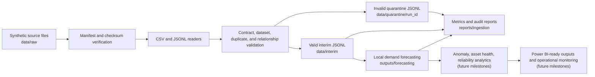

# Data Flow

Milestone 3 implements local governed movement from raw synthetic source files into interim and quarantine zones.

The matching Azure pattern is Event Hubs, Azure Functions or Stream Analytics, Data Lake Storage Gen2 raw/quarantine/silver zones, Azure Monitor or Application Insights, Microsoft Purview, Azure Data Explorer or Synapse, Azure Machine Learning, and Power BI. These are mappings only; no Azure resources are deployed.
