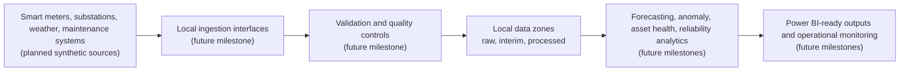

# Data Flow

Milestone 1 establishes the intended flow without implementing data movement.

The matching Azure pattern is Event Hubs, stream processing, Data Lake Storage Gen2, Azure Data Explorer or Synapse, Azure Machine Learning, Azure Monitor, and Power BI.

