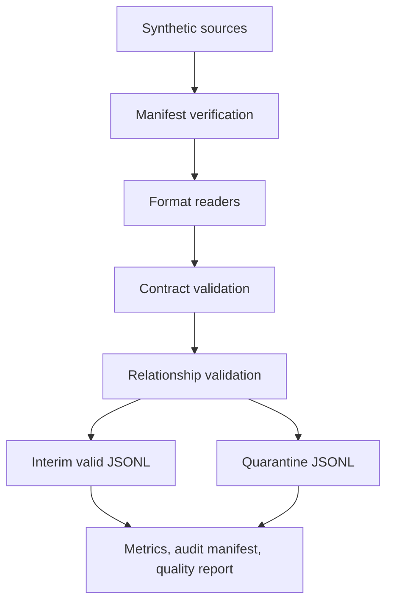

# Governed Ingestion Design

Milestone 3 implements a local-first ingestion flow for the six fictional synthetic source datasets. It does not connect to Event Hubs, ADLS Gen2, Azure Functions, Stream Analytics, Purview, or Azure Monitor.

The implemented stages are explicit:

1. Load `configs/ingestion.yaml` or `configs/ingestion_ci.yaml`.
2. Load YAML data contracts from `configs/data_contracts/`.
3. Discover expected files from contract dataset names and formats.
4. Verify `_manifest.json`, file sizes, checksums, and record counts.
5. Read CSV and JSON Lines with source filename and row or line metadata.
6. Validate fields, dataset rules, duplicates, and cross-dataset relationships.
7. Write valid records to `data/interim/*.jsonl`.
8. Write invalid records to `data/quarantine/<run_id>/*.jsonl`.
9. Write `metrics.json`, `ingestion_manifest.json`, and `data_quality_report.md`.

The JSONL event reader is finite and local. It demonstrates a future consumer boundary, but it is not a live stream.
