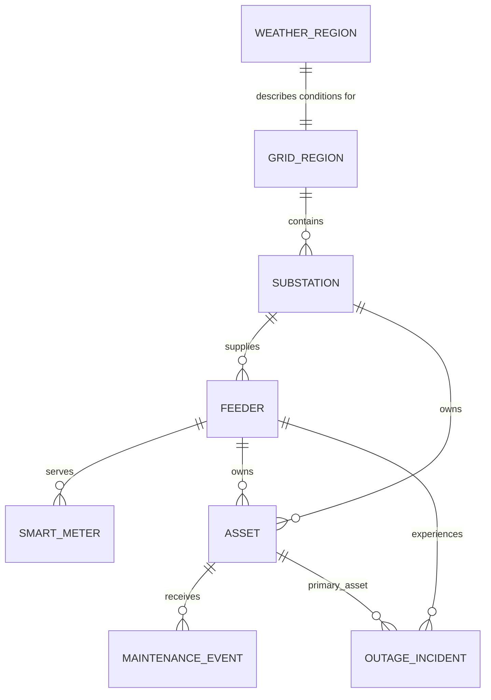

# Synthetic Data Design

Milestone 2 models a fictional UK-style distribution network for local analytics development. It does not describe a real utility, customer, address, postcode, coordinate, substation, feeder, or critical-infrastructure asset.

## Network Topology

Regions use fictional identifiers: `GRID-NORTH`, `GRID-SOUTH`, `GRID-EAST`, `GRID-WEST`, and `GRID-CENTRAL`.

## Generation Assumptions

- Smart meter demand follows daily, weekly, seasonal, and weather-sensitive patterns.
- Commercial and public-service loads are higher during working hours.
- Residential load has evening peaks.
- Industrial load is steadier on weekdays.
- Substation utilisation responds to feeder capacity, weekday patterns, and ambient temperature.
- Transformer and oil temperatures respond to load and weather.
- Maintenance activity varies by asset type and synthetic status.
- Outages reference valid fictional feeders and assets but do not calculate SAIDI, SAIFI, CAIDI, or other reliability aggregates.

## Reproducibility

Dataset records are deterministic for a fixed configuration and seed. The manifest includes a generation timestamp, so the manifest is expected to change between runs even when dataset checksums remain stable.

