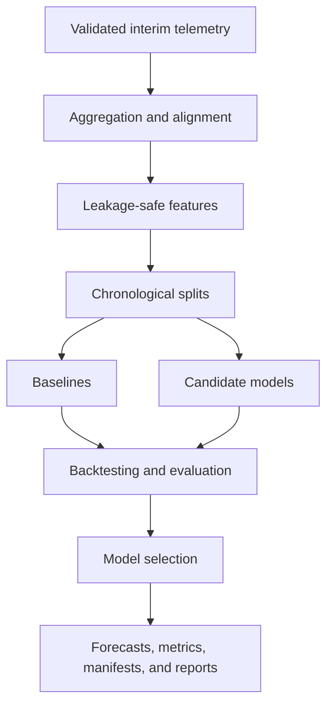

# Electricity Demand Forecasting Design

Milestone 4 implements a fully local forecasting workflow over validated interim telemetry. It consumes `data/interim/*.jsonl` only; it does not train from `data/raw/` and does not deploy Azure resources.

Supported targets:

- `active_energy_kwh` from `smart_meter_events`, aggregated as interval energy in kWh;
- `load_mw` from `substation_events`, aggregated as interval-aligned load in MW.

Supported grains are `grid_region`, `substation`, and `feeder`. The CI profile uses `grid_region` and one-interval-ahead forecasting because the small synthetic profile contains six hourly timestamps. Day-ahead forecasting is not claimed for that profile.

The implemented modelling strategy is pooled across eligible entities. Entity identity remains explicit in every forecast row and metric.
