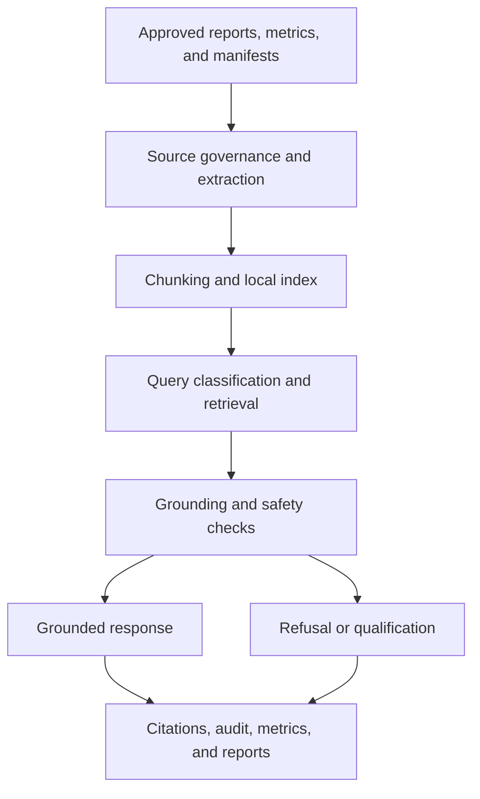

# Assistant Architecture

Milestone 9 implements a local, provider-neutral Grid Operations Assistant. It
uses only governed repository evidence from reports, metrics, manifests, outputs,
documentation, and contracts.

No Azure AI Foundry, Azure AI Search, Azure OpenAI, external model, internet
access, or operational action is used.
