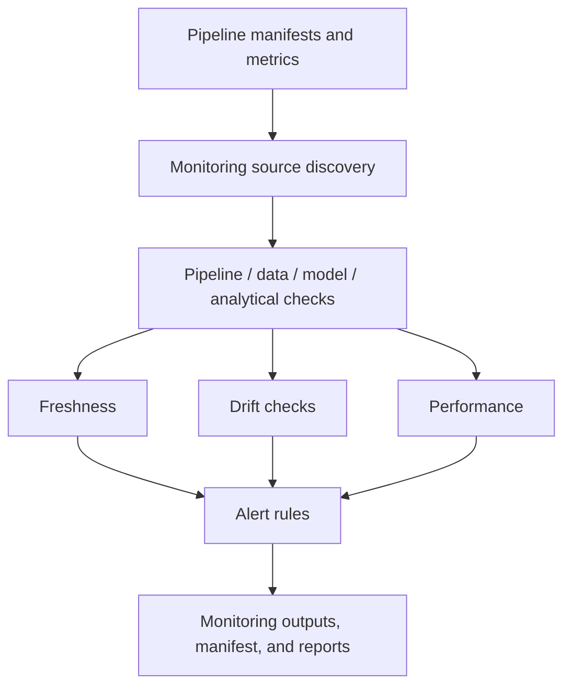

# Monitoring Architecture

Milestone 8 adds deterministic local observability for the repository's batch
pipelines and analytical outputs. It reads local manifests, metrics, model
metadata, CSV outputs, contracts, and validated datasets, then writes structured
monitoring records and Markdown reports.

No live telemetry, Azure SDK connectivity, external alert delivery, dashboard, or
cloud deployment is implemented.
